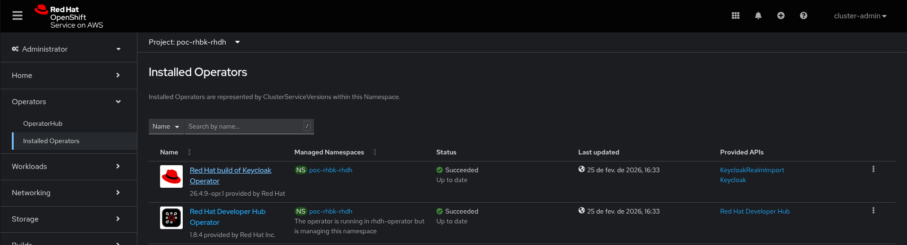

# Red Hat Developer Hub (RHDH) Integration with Red Hat build of Keycloak (RHBK)

This repository provides a complete guide and the necessary manifests to install and integrate the Red Hat Developer Hub with Red Hat build of Keycloak on OpenShift. 

## 🏗️ Architecture Overview
The integration consists of two main parts:
1. **Red Hat build of Keycloak (RHBK):** Acts as the Identity Provider (IdP) for authentication and the source of truth for Users.
2. **Red Hat Developer Hub (RHDH):** The developer portal that uses Keycloak for OIDC authentication and synchronizes its software catalog with Keycloak's organizational data.

## 📁 Repository Structure
* **`rhbk/`**: Contains manifests for deploying Keycloak, its PostgreSQL database, and the `rhdh` realm configuration.
* **`developer-hub/`**: Contains the RHDH Custom Resource, dynamic plugin configurations, and app-level settings.

## 🚀 Deployment Roadmap

To achieve a successful integration, follow the documentation in each subdirectory in this specific order:

### Phase 1: Identity Provider Setup
Navigate to the [RHBK directory](./rhbk/README.md) to:
1. Deploy a PostgreSQL database for Keycloak.
2. Configure TLS certificates and deploy the Keycloak Operator/Instance.
3. Import the pre-configured `rhdh-realm.json` and set up the `rhdh-catalog` client.

### Phase 2: Developer Hub Setup
Once Keycloak is running and configured, navigate to the [Developer Hub directory](./developer-hub/README.md) to:
1. Configure `app-config.yaml` with the OIDC endpoints and secrets generated in Phase 1.
2. Enable the Keycloak dynamic plugin via ConfigMap.
3. Deploy the RHDH instance via the Backstage Custom Resource.

## Common

For this POC it is recommended to create the Red Hat build of Keycloak Operator instance and the Red Hat Developer Hub on the same namespace / project. E.g:
~~~
oc new-project poc-rhbk-rhdh
~~~

Having the resources in the same namespace makes things more easier when troubleshooting, but feel free to use different namespaces as necessary.

## 🔐 Security Note
By default, this repository is configured for a **Proof of Concept (POC)**. It uses `NODE_TLS_REJECT_UNAUTHORIZED: "0"` to bypass certificate validation for self-signed certificates. This must be changed for production environments.

## 🛠️ Prerequisites
* An OpenShift cluster with both the **Keycloak Operator** and **Red Hat Developer Hub Operator** installed.
   

* The `oc` CLI tool authenticated to your cluster.
* `openssl` for local certificate generation.