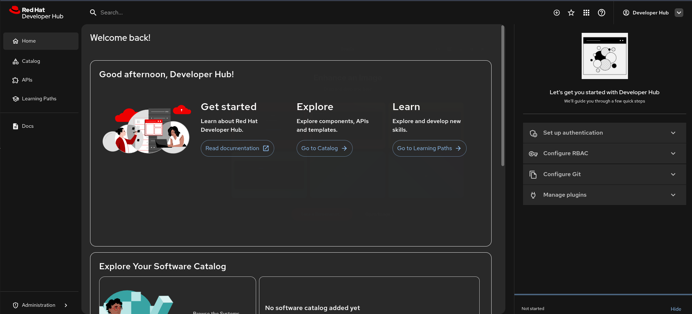

# RHDH Operator - Basic Quickstart Deployment for OpenShift integrated with RHBK

This guide covers the deployment of Red Hat Developer Hub (RHDH) integrated with Red Hat build of Keycloak (RHBK).

## Prerequisites
- An OpenShift cluster with the Developer Hub Operator installed.
- `oc` CLI tool authenticated to your cluster.

## Deployment Steps

1. Create a namespace for the developer hub demo
   ```
   oc new-project devhub-demo
   ```

2. Create the secret with the keycloak credentials
   ```
   oc create secret generic rhbk-secret --from-literal KEYCLOAK_BASE_URL="https://$(oc get routes/rhbk-route -o jsonpath='{.spec.host}' -n rhbk && echo)" --from-literal KEYCLOAK_CLIENT_ID=rhdh --from-literal KEYCLOAK_CLIENT_SECRET=rhdh-super-secret --from-literal KEYCLOAK_REALM=rhdh -n devhub-demo
   ```

3. Create the configmap that enables the Red Hat build of Keycloak dynamic plugin
   ```
   oc create configmap rhbk-dynamic-plugin --from-file developer-hub/dynamic-plugins.yaml -n devhub-demo
   ```

3. Create the app config that contains the RHBK configuration
   ```
   oc create configmap rhbk-app-config --from-file developer-hub/app-config.yaml -n devhub-demo
   ```

4. Create the `registry.redhat.io` pull secret for `dynamic plugins` installation
   ```
   podman login registry.redhat.io
   oc create secret generic dynamic-plugins-registry-auth --from-file=auth.json=${XDG_RUNTIME_DIR:-~/.config}/containers/auth.json -n devhub-demo
   ```

5. Deploy Backstage CR
   ```
   oc apply -f developer-hub/backstage.yaml -n devhub-demo
   ```

6. Create the `rhdh` realm with the `rhdh` client in Red Hat build of Keycloak
   ```
   sed "s|DEVELOPER_HUB_HOSTNAME|$(oc get routes/backstage-developer-hub -o jsonpath='{.spec.host}' -n devhub-demo)|g" rhbk/rhdh-realm.yaml | oc apply -n rhbk -f -
   ```
   Check the realm import conditions:
   ```
   oc get keycloakrealmimport/developer-hub-realm -n rhbk -o jsonpath='{.status}' | yq -P
   ```
   It should match the following output:
   ```
   conditions:
     - message: ""
       status: "True"
       type: Done
     - message: ""
       status: "False"
       type: Started
     - message: ""
       status: "False"
       type: HasErrors
   ```

7. Access the developer hub page and login via "oidc". The credentials are `Username: test | Password: test`:
   ```
   echo "Developer Hub Console: https://$(oc get routes/backstage-developer-hub -o jsonpath='{.spec.host}' -n devhub-demo && echo)"
   ```
   Access the developer hub url
    
   Login with the user
    
   See the console
    