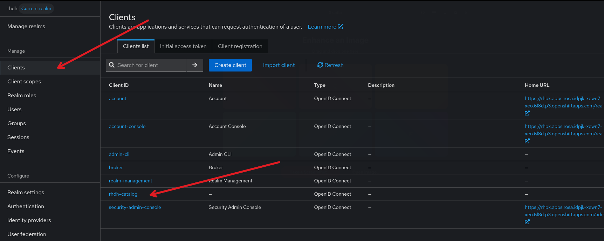
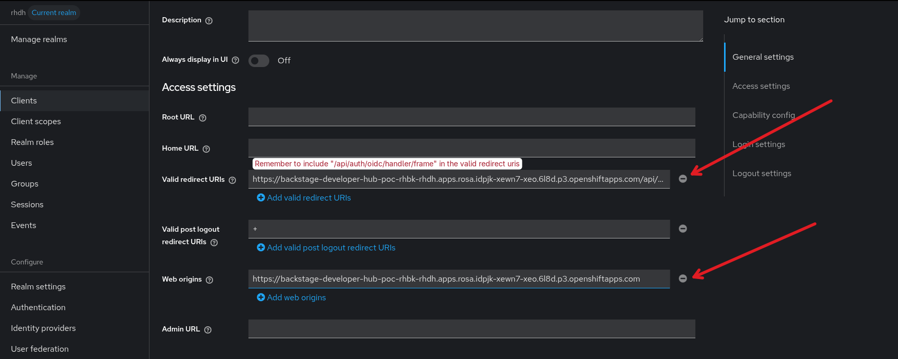
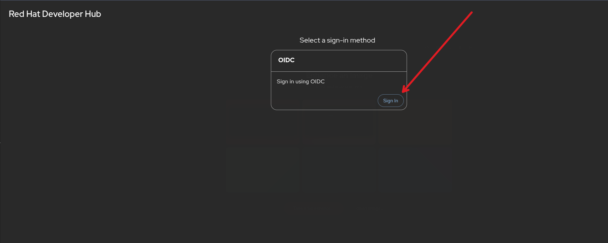
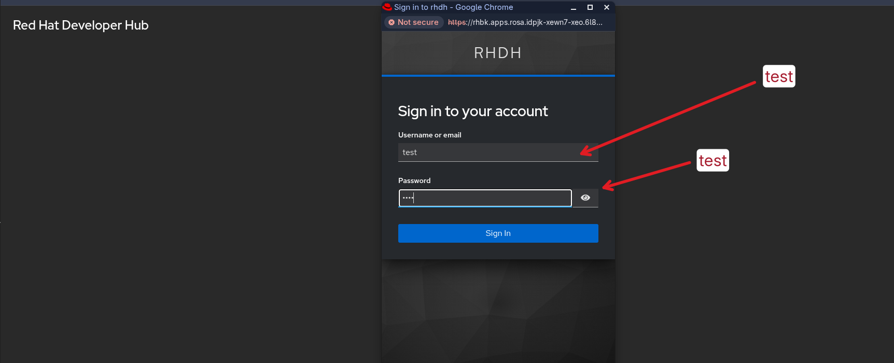

# RHDH Operator - Basic Quickstart Deployment for OpenShift integrated with RHBK

This guide covers the deployment of Red Hat Developer Hub (RHDH) integrated with Red Hat build of Keycloak (RHBK).

## Prerequisites
- An OpenShift cluster with the Developer Hub Operator installed.
- `oc` CLI tool authenticated to your cluster.

## Configuration Setup

Before deploying, update `app-config.yaml` with your specific environment details:
- **metadataUrl**: Your Keycloak OpenID configuration endpoint.
- **clientId/clientSecret**: Your Keycloak client credentials.
- **baseUrl**: Your RHBK host URL.

## Deployment Steps

1. Create the secret with the keycloak credentials
   ~~~
   oc create secret generic rhdh-rhbk-cred --from-literal KEYCLOAK_BASE_URL="https://rhbk.apps.myclustername.mydomain.com" --from-literal KEYCLOAK_CLIENT_ID=rhdh-catalog --from-literal KEYCLOAK_CLIENT_SECRET=yrYCAqASuxFir18MoMm0jJClPqNMmc9Y --from-literal KEYCLOAK_REALM=rhdh
   ~~~
   **Note**: Remember to replace `rhbk.apps.myclustername.mydomain.com` with your Keycloak hostname

2. Create the configmap that enables the Red Hat build of Keycloak dynamic plugin
   ```
   oc create configmap rhbk-dynamic-plugin --from-file dynamic-plugins.yaml
   ```

3. Create the app config that contains the RHBK configuration
   ```
   oc create configmap rhbk-app-config --from-file app-config.yaml
   ```

4. Deploy Backstage CR
   ```
   oc apply -f backstage.yaml
   ```
   **NOTE**: The current `backstage.yaml` uses `NODE_TLS_REJECT_UNAUTHORIZED=0` to bypass certificate validation for RHBK. This is intended for Proof of Concept (POC) only. For production, this must be removed.

5. Go back to RHBK web console, select the client `rhdh-catalog` and update the `Valid Redirect Uris` and the `Web Origins` with the Developer Hub hostname.
**Note**: The `Valid Redirect Uris` must include the oidc handler path. E.g: `https://developerhub.hostname.com/api/auth/oidc/handler/frame`
   - Select the client
     
   - Update the redirect uris and web origins
     


6. Access the developer hub page and login via "oidc". The credentials are:
username: `test`
password: `test`
   - Access the developer hub url
      
   - Login with the user
      
   - See the console
      